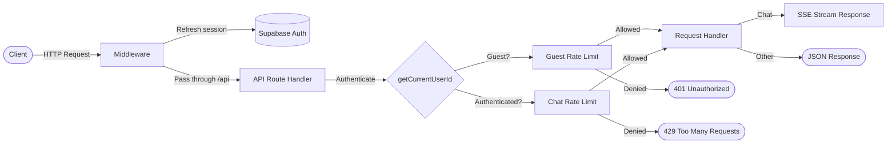

# API Reference

Complete REST API reference for Vana v2. All endpoints are served from the Next.js application under the `/api` path prefix.

**Base URL:** `http://localhost:43100` (development) or your deployed domain.

## Request Flow



## Authentication

Vana v2 uses **Supabase Auth** with cookie-based sessions. The middleware (`lib/supabase/middleware.ts`) refreshes the session on every request using `@supabase/ssr`.

| Mode              | Behavior                                                                                                                      |
| ----------------- | ----------------------------------------------------------------------------------------------------------------------------- |
| **Authenticated** | Supabase JWT stored in HTTP-only cookies. User ID extracted via `supabase.auth.getUser()`.                                    |
| **Guest**         | Allowed when `ENABLE_GUEST_CHAT=true`. Identified by IP address. Limited feature set (speed model only, no persistence).      |
| **Auth Disabled** | When `ENABLE_AUTH=false` (non-cloud only). All requests use a shared anonymous user ID. For personal/Docker deployments only. |

Unauthenticated requests to protected endpoints receive a `401 Unauthorized` response.

---

## Endpoints

### POST `/api/chat`

The primary chat endpoint. Accepts a user message and returns a Server-Sent Events (SSE) stream containing the AI-generated response with tool results, search data, and reasoning.

**Authentication:** Required (or guest mode enabled)
**Timeout:** 300 seconds (`maxDuration = 300`)
**Dynamic:** `force-dynamic` (no caching)

#### Request Body

```typescript
{
  message: string          // Required for trigger="submit-message"
  messages?: Message[]     // Full message history (used for guest/ephemeral chats)
  chatId: string           // Chat session identifier
  trigger: string          // "submit-message" | "regenerate-message"
  messageId?: string       // Required for trigger="regenerate-message"
  isNewChat?: boolean      // Whether this is the first message in a chat
}
```

| Field       | Type        | Required    | Description                                                                                        |
| ----------- | ----------- | ----------- | -------------------------------------------------------------------------------------------------- |
| `message`   | `string`    | Conditional | The user's message text. Required when `trigger` is `"submit-message"`.                            |
| `messages`  | `Message[]` | No          | Full conversation history. Used for guest/ephemeral streaming.                                     |
| `chatId`    | `string`    | Yes         | Unique identifier for the chat session.                                                            |
| `trigger`   | `string`    | Yes         | Action type: `"submit-message"` for new messages, `"regenerate-message"` to regenerate a response. |
| `messageId` | `string`    | Conditional | ID of the message to regenerate. Required when `trigger` is `"regenerate-message"`.                |
| `isNewChat` | `boolean`   | No          | Indicates a new chat session. Affects analytics tracking.                                          |

#### Cookies Read

| Cookie       | Values                  | Default   | Description                                                                            |
| ------------ | ----------------------- | --------- | -------------------------------------------------------------------------------------- |
| `searchMode` | `"quick"`, `"adaptive"` | `"quick"` | Controls the research agent mode. Quick uses max 20 steps; adaptive uses max 50 steps. |
| `modelType`  | `"speed"`, `"quality"`  | `"speed"` | Model selection preference. Guests and cloud deployments are forced to `"speed"`.      |

#### Response

**Content-Type:** `text/event-stream` (SSE)

The response is a streaming SSE connection. Message parts (text, search results, reasoning, tool calls) are streamed incrementally using the Vercel AI SDK data protocol.

#### Error Responses

| Status                      | Condition                                                                                                            |
| --------------------------- | -------------------------------------------------------------------------------------------------------------------- |
| `400 Bad Request`           | Missing `message` for submit trigger, or missing `messageId` for regenerate trigger.                                 |
| `401 Unauthorized`          | No authenticated user and guest mode is disabled. Also returned when guest rate limit is exceeded (prompts sign-in). |
| `403 Forbidden`             | Request originated from a `/share/` page. Chat API is blocked on share pages.                                        |
| `404 Not Found`             | Selected AI provider is not enabled in the registry.                                                                 |
| `429 Too Many Requests`     | Authenticated user exceeded daily chat limit (cloud deployments only).                                               |
| `500 Internal Server Error` | Unexpected server error during processing.                                                                           |

#### Example

```bash
curl -X POST http://localhost:43100/api/chat \
  -H "Content-Type: application/json" \
  -H "Cookie: <supabase-auth-cookies>" \
  -d '{
    "message": "What is quantum computing?",
    "chatId": "clx1abc123def456",
    "trigger": "submit-message",
    "isNewChat": true
  }'
```

---

### GET `/api/chats`

Retrieves a paginated list of chats for the currently authenticated user.

**Authentication:** Required (via Supabase session in `getChatsPage` server action)
**Dynamic:** `force-dynamic`

#### Query Parameters

| Parameter | Type      | Default | Description                                 |
| --------- | --------- | ------- | ------------------------------------------- |
| `offset`  | `integer` | `0`     | Number of chats to skip for pagination.     |
| `limit`   | `integer` | `20`    | Maximum number of chats to return per page. |

#### Response

**Content-Type:** `application/json`

```typescript
{
  chats: Chat[]            // Array of chat objects
  nextOffset: number | null // Offset for the next page, or null if no more results
}
```

Each `Chat` object:

```typescript
{
  id: string // Unique chat identifier (CUID2)
  createdAt: string // ISO 8601 timestamp
  title: string // Chat title (auto-generated or "Untitled")
  userId: string // Owner's user ID
  visibility: 'public' | 'private'
}
```

#### Error Responses

| Status                      | Condition                                                         |
| --------------------------- | ----------------------------------------------------------------- |
| `500 Internal Server Error` | Database query failed. Returns `{ chats: [], nextOffset: null }`. |

#### Example

```bash
curl "http://localhost:43100/api/chats?offset=0&limit=10" \
  -H "Cookie: <supabase-auth-cookies>"
```

```json
{
  "chats": [
    {
      "id": "clx1abc123def456",
      "createdAt": "2025-01-15T10:30:00.000Z",
      "title": "Quantum Computing Explained",
      "userId": "user-uuid-here",
      "visibility": "private"
    }
  ],
  "nextOffset": 10
}
```

---

### POST `/api/upload`

Uploads a file (image or PDF) to Supabase Storage, scoped to a specific chat.

**Authentication:** Required

#### Request

**Content-Type:** `multipart/form-data`

| Field    | Type     | Required | Description                         |
| -------- | -------- | -------- | ----------------------------------- |
| `file`   | `File`   | Yes      | The file to upload.                 |
| `chatId` | `string` | Yes      | Chat ID to associate the file with. |

#### Constraints

| Constraint         | Value                                        |
| ------------------ | -------------------------------------------- |
| Max file size      | 5 MB                                         |
| Allowed MIME types | `image/jpeg`, `image/png`, `application/pdf` |

#### Response

**Content-Type:** `application/json`

**Success (200):**

```typescript
{
  success: true
  file: {
    filename: string // Original filename
    url: string // Public URL of the uploaded file
    mediaType: string // MIME type (e.g., "image/png")
    type: 'file'
  }
}
```

#### Error Responses

| Status | Body                                         | Condition                             |
| ------ | -------------------------------------------- | ------------------------------------- |
| `400`  | `{ error: "Invalid content type" }`          | Request is not `multipart/form-data`. |
| `400`  | `{ error: "File is required" }`              | No `file` field in form data.         |
| `400`  | `{ error: "File too large (max 5MB)" }`      | File exceeds 5 MB.                    |
| `400`  | `{ error: "Unsupported file type" }`         | MIME type not in allowed list.        |
| `401`  | `{ error: "Unauthorized" }`                  | User is not authenticated.            |
| `500`  | `{ error: "Upload failed", message: "..." }` | Supabase storage error.               |

#### Example

```bash
curl -X POST http://localhost:43100/api/upload \
  -H "Cookie: <supabase-auth-cookies>" \
  -F "file=@screenshot.png" \
  -F "chatId=clx1abc123def456"
```

---

### POST `/api/feedback`

Records user feedback (thumbs up/down) on an AI response. Sends the score to Langfuse for tracing analytics and optionally updates the message metadata in the database.

**Authentication:** Optional (feedback is recorded even without auth, but database update requires a user context for RLS)
**Dynamic:** `force-dynamic`

#### Request Body

```typescript
{
  traceId: string          // Langfuse trace ID for the AI response
  score: 1 | -1            // 1 = positive (thumbs up), -1 = negative (thumbs down)
  comment?: string         // Optional text comment
  messageId?: string       // Database message ID to update metadata
}
```

| Field       | Type      | Required | Description                                                                  |
| ----------- | --------- | -------- | ---------------------------------------------------------------------------- |
| `traceId`   | `string`  | Yes      | The Langfuse trace ID associated with the response.                          |
| `score`     | `1 \| -1` | Yes      | Feedback score. Must be exactly `1` or `-1`.                                 |
| `comment`   | `string`  | No       | Optional comment explaining the feedback.                                    |
| `messageId` | `string`  | No       | If provided, updates the message's `metadata.feedbackScore` in the database. |

#### Response

**Content-Type:** `text/plain`

| Status | Body                                   | Condition                                               |
| ------ | -------------------------------------- | ------------------------------------------------------- |
| `200`  | `"Feedback tracking is not enabled"`   | Langfuse tracing is not configured (graceful no-op).    |
| `200`  | `"Feedback recorded successfully"`     | Feedback sent to Langfuse (and optionally saved to DB). |
| `400`  | `"traceId is required"`                | Missing `traceId` field.                                |
| `400`  | `"score must be 1 (good) or -1 (bad)"` | Invalid score value.                                    |
| `500`  | `"Error recording feedback"`           | Unexpected error during processing.                     |

#### Example

```bash
curl -X POST http://localhost:43100/api/feedback \
  -H "Content-Type: application/json" \
  -d '{
    "traceId": "trace-abc123",
    "score": 1,
    "messageId": "msg-xyz789"
  }'
```

---

### POST `/api/advanced-search`

Performs a SearXNG-powered web search with optional deep crawling and relevance scoring. Results are cached in Redis for 1 hour.

**Authentication:** None
**Dynamic:** `force-dynamic`

> **Note:** This endpoint requires a self-hosted SearXNG instance. It is separate from the primary Tavily/Brave search used by the chat agent tools.

#### Request Body

```typescript
{
  query: string                // Search query
  maxResults?: number          // Max results to return (capped at SEARXNG_MAX_RESULTS)
  searchDepth?: "basic" | "advanced"  // "advanced" enables page crawling
  includeDomains?: string[]    // Only include results from these domains
  excludeDomains?: string[]    // Exclude results from these domains
}
```

| Field            | Type       | Required | Description                                                                                                                                            |
| ---------------- | ---------- | -------- | ------------------------------------------------------------------------------------------------------------------------------------------------------ |
| `query`          | `string`   | Yes      | The search query string.                                                                                                                               |
| `maxResults`     | `number`   | No       | Maximum number of results. Capped by `SEARXNG_MAX_RESULTS` env var (default 50).                                                                       |
| `searchDepth`    | `string`   | No       | `"basic"` returns SearXNG snippets; `"advanced"` crawls pages, extracts content, and ranks by relevance. Default from `SEARXNG_DEFAULT_DEPTH` env var. |
| `includeDomains` | `string[]` | No       | Filter results to only these domains.                                                                                                                  |
| `excludeDomains` | `string[]` | No       | Exclude results from these domains.                                                                                                                    |

#### Response

**Content-Type:** `application/json`

```typescript
{
  results: Array<{
    title: string            // Page title
    url: string              // Page URL
    content: string          // Snippet or extracted content
  }>
  query: string              // Echo of the search query
  images: string[]           // Array of image URLs from results
  number_of_results: number  // Total number of results found
}
```

#### Error Responses

| Status | Body                                                                                                       | Condition                                   |
| ------ | ---------------------------------------------------------------------------------------------------------- | ------------------------------------------- |
| `500`  | `{ message: "Internal Server Error", error: "...", query, results: [], images: [], number_of_results: 0 }` | SearXNG API failure or configuration error. |

#### Environment Variables

| Variable                   | Default                              | Description                                             |
| -------------------------- | ------------------------------------ | ------------------------------------------------------- |
| `SEARXNG_API_URL`          | (required)                           | Base URL of the SearXNG instance.                       |
| `SEARXNG_MAX_RESULTS`      | `50`                                 | Maximum results cap (10-100).                           |
| `SEARXNG_DEFAULT_DEPTH`    | `"basic"`                            | Default search depth.                                   |
| `SEARXNG_ENGINES`          | `"google,bing,duckduckgo,wikipedia"` | Comma-separated search engines.                         |
| `SEARXNG_TIME_RANGE`       | `"None"`                             | Time range filter (e.g., `"day"`, `"week"`, `"month"`). |
| `SEARXNG_SAFESEARCH`       | `"0"`                                | Safe search level (0=off, 1=moderate, 2=strict).        |
| `SEARXNG_CRAWL_MULTIPLIER` | `"4"`                                | Multiplier for pages to crawl in advanced mode.         |

---

## Rate Limiting

Rate limits are enforced only in **cloud deployments** (`VANA_CLOUD_DEPLOYMENT=true`) using Upstash Redis.

### Guest Rate Limits

| Setting    | Default                | Description                                        |
| ---------- | ---------------------- | -------------------------------------------------- |
| Limit      | 10 requests/day        | Configurable via `GUEST_CHAT_DAILY_LIMIT` env var. |
| Window     | Resets at midnight UTC | Key: `rl:guest:chat:{ip}:{date}`                   |
| Identifier | Client IP address      | From `x-forwarded-for` or `x-real-ip` headers.     |

When the guest limit is exceeded, the response is:

```json
{
  "error": "Please sign in to continue.",
  "remaining": 0,
  "resetAt": 1706745600000,
  "limit": 10
}
```

**Status:** `401 Unauthorized`
**Headers:**

- `X-RateLimit-Limit` -- Daily limit
- `X-RateLimit-Remaining` -- Remaining requests
- `X-RateLimit-Reset` -- UTC timestamp (ms) when the limit resets

### Authenticated Rate Limits

| Setting    | Value                  | Description                    |
| ---------- | ---------------------- | ------------------------------ |
| Limit      | 100 requests/day       | Hardcoded `DAILY_CHAT_LIMIT`.  |
| Window     | Resets at midnight UTC | Key: `rl:chat:{userId}:{date}` |
| Identifier | Supabase user ID       | Extracted from auth session.   |

When the authenticated limit is exceeded, the response is:

```json
{
  "error": "Daily chat limit reached. Please try again tomorrow.",
  "remaining": 0,
  "resetAt": 1706745600000,
  "limit": 100
}
```

**Status:** `429 Too Many Requests`
**Headers:**

- `X-RateLimit-Limit` -- Daily limit
- `X-RateLimit-Remaining` -- Remaining requests
- `X-RateLimit-Reset` -- UTC timestamp (ms) when the limit resets

### Non-Cloud Deployments

When not in cloud deployment mode (or when Upstash Redis is not configured), all rate limits are bypassed and requests are allowed without restriction.

---

## Error Response Conventions

All API endpoints follow consistent error patterns:

| Status | Meaning                                                          |
| ------ | ---------------------------------------------------------------- |
| `200`  | Success.                                                         |
| `400`  | Bad request -- missing or invalid parameters.                    |
| `401`  | Unauthorized -- authentication required or guest limit exceeded. |
| `403`  | Forbidden -- action not allowed in the current context.          |
| `404`  | Not found -- requested resource or provider does not exist.      |
| `429`  | Too many requests -- rate limit exceeded (authenticated users).  |
| `500`  | Internal server error -- unexpected failure.                     |

Error bodies vary by endpoint:

- **Chat and feedback endpoints** return plain text error messages.
- **Upload and chats endpoints** return JSON with an `error` field.
- **Rate limit responses** return JSON with `error`, `remaining`, `resetAt`, and `limit` fields plus `X-RateLimit-*` headers.
