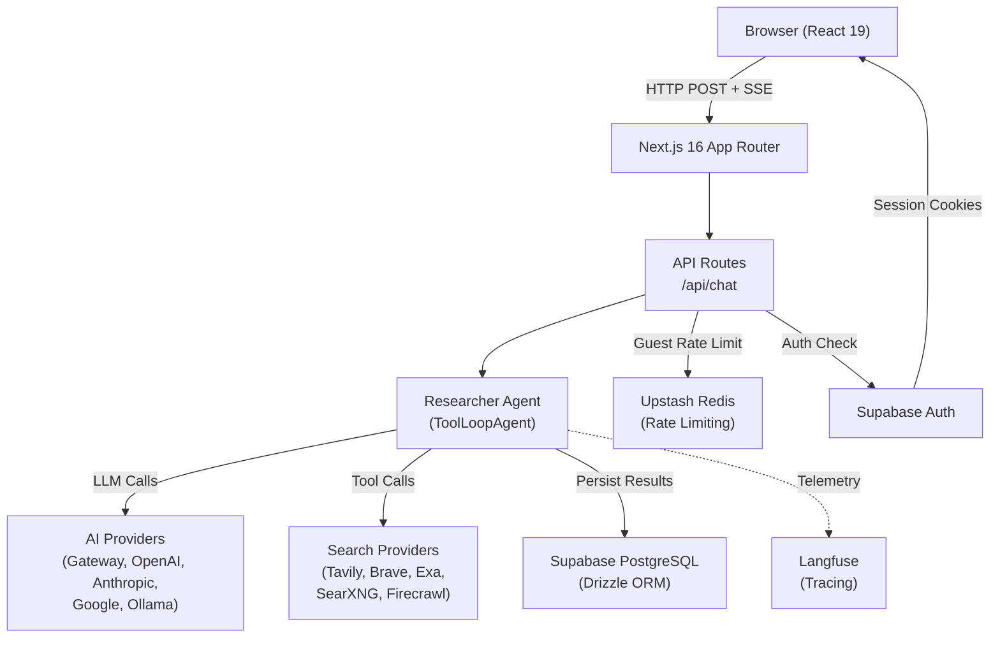
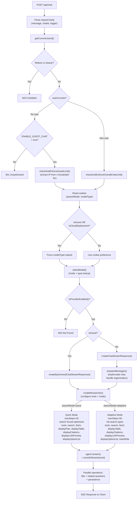
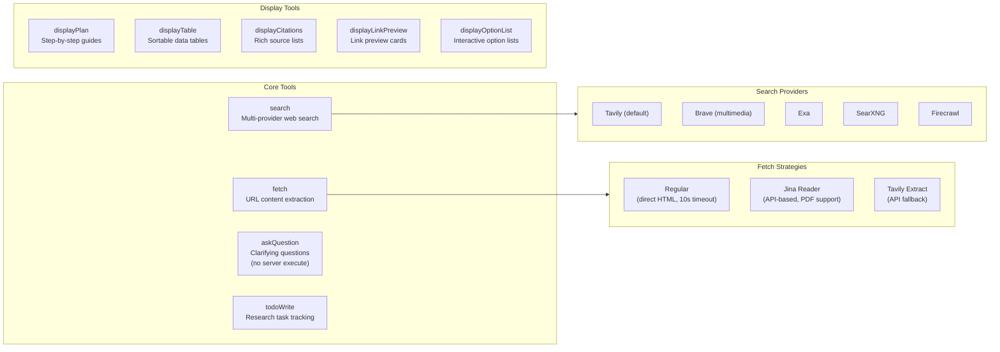
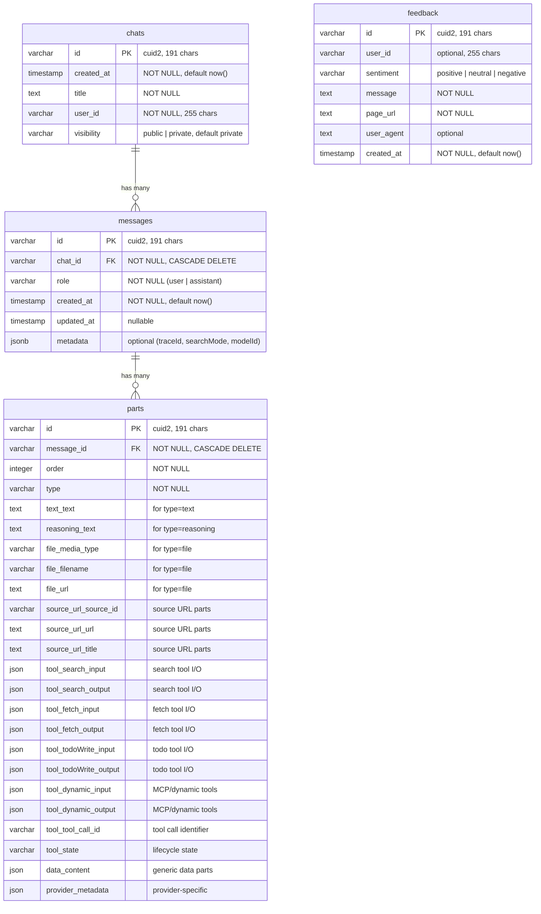
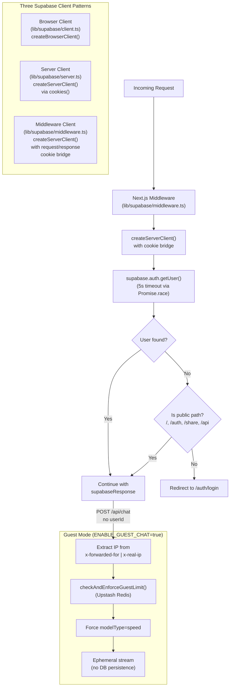
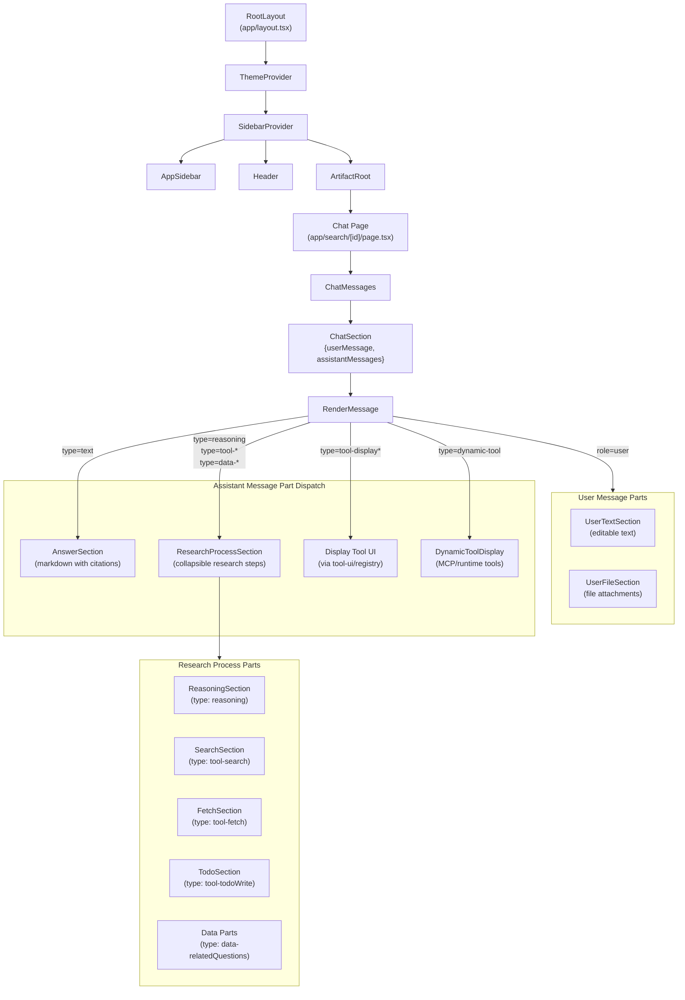
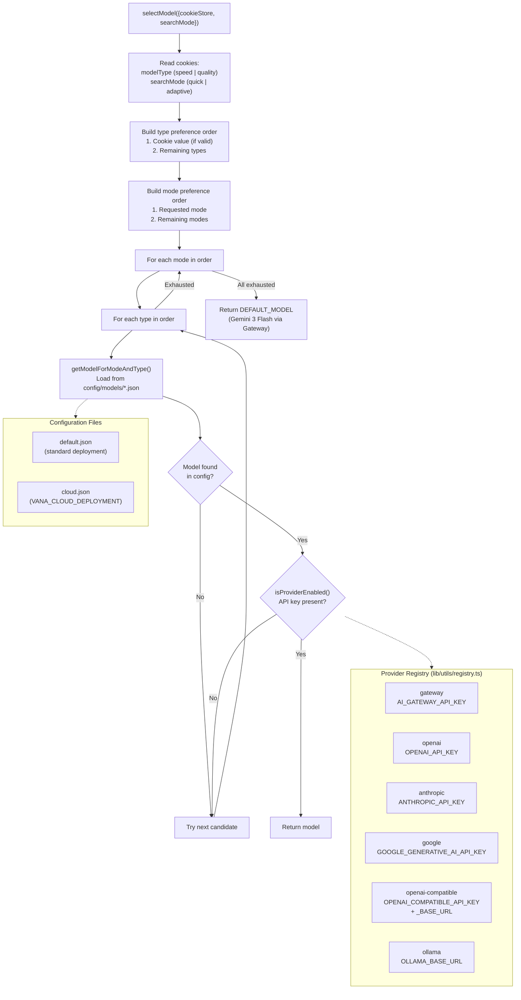
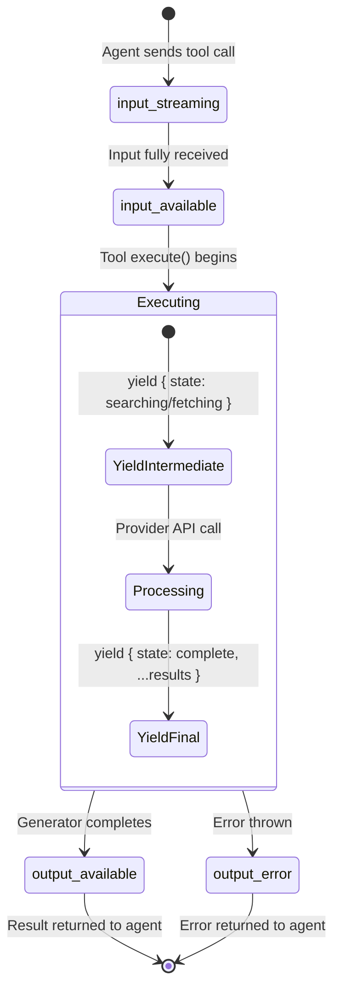
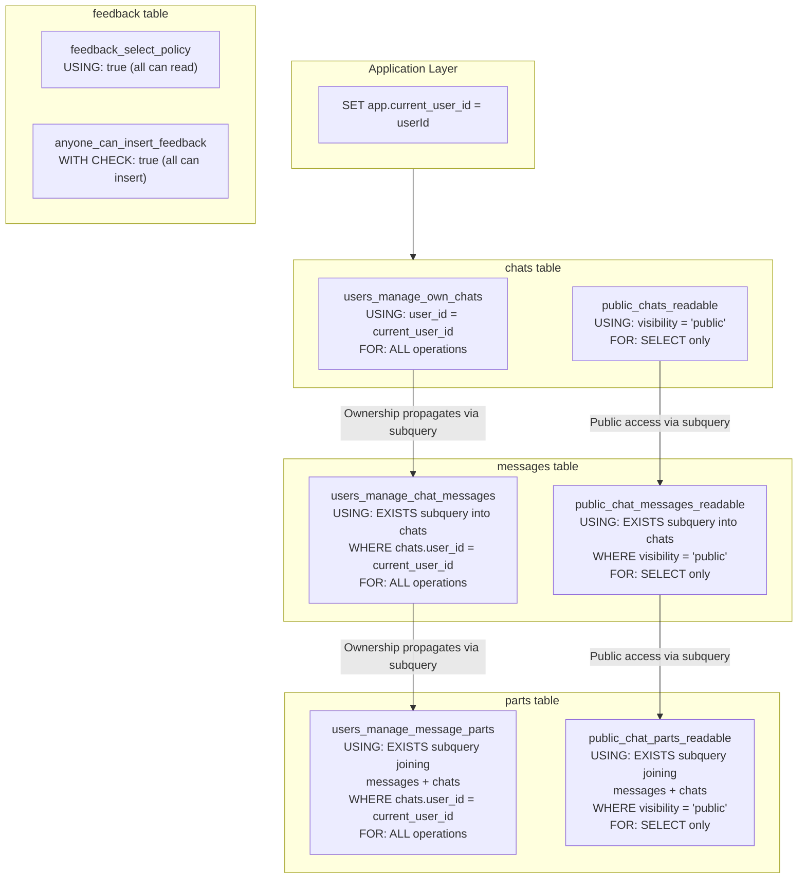

# Architecture

This document describes the internal architecture of Vana v2 — an AI-powered answer engine with generative UI. It covers the agent pipeline, tool system, streaming infrastructure, database schema, authentication, UI rendering, and model selection.

## Table of Contents

- [System Overview](#system-overview)
- [Agent Pipeline](#agent-pipeline)
- [Tool System](#tool-system)
- [Streaming Architecture](#streaming-architecture)
- [Database Schema](#database-schema)
- [Authentication Flow](#authentication-flow)
- [Generative UI Component Tree](#generative-ui-component-tree)
- [Model Selection](#model-selection)
- [Tool State Lifecycle](#tool-state-lifecycle)
- [RLS Policy Chain](#rls-policy-chain)
- [Key File Reference](#key-file-reference)

---

## System Overview

Vana v2 is built on Next.js 16 (App Router) with React 19. A single chat API endpoint orchestrates an AI agent that performs multi-step research using tools (search, fetch, question, todo) and streams structured responses back to the browser as Server-Sent Events (SSE). The generative UI layer renders each message part — text, reasoning, tool results, data attachments — using dedicated React components.



**Key source files:**

| Concern                 | File                                                                                                                  |
| ----------------------- | --------------------------------------------------------------------------------------------------------------------- |
| Chat API endpoint       | [`app/api/chat/route.ts`](../app/api/chat/route.ts)                                                                   |
| Agent orchestration     | [`lib/agents/researcher.ts`](../lib/agents/researcher.ts)                                                             |
| Authenticated streaming | [`lib/streaming/create-chat-stream-response.ts`](../lib/streaming/create-chat-stream-response.ts)                     |
| Guest streaming         | [`lib/streaming/create-ephemeral-chat-stream-response.ts`](../lib/streaming/create-ephemeral-chat-stream-response.ts) |
| Database schema         | [`lib/db/schema.ts`](../lib/db/schema.ts)                                                                             |
| Provider registry       | [`lib/utils/registry.ts`](../lib/utils/registry.ts)                                                                   |

---

## Agent Pipeline

Every chat request follows a single path through the API route into the streaming infrastructure. The route authenticates the user (or validates guest access), selects a model, and delegates to either the authenticated or ephemeral stream handler.



The `createResearcher` function in [`lib/agents/researcher.ts`](../lib/agents/researcher.ts) wraps the Vercel AI SDK's `ToolLoopAgent`. In quick mode, the search tool is wrapped via `wrapSearchToolForQuickMode` to force `type: 'optimized'` on every call, and the step limit is 20. In adaptive mode, the agent has access to the `todoWrite` tool (when a stream writer is available) and can run up to 50 steps with full search type support (general + optimized).

**Request body fields:**

| Field       | Purpose                                               |
| ----------- | ----------------------------------------------------- |
| `message`   | The user's message (required for `submit-message`)    |
| `messages`  | Full message history (used by ephemeral/guest path)   |
| `chatId`    | Chat identifier                                       |
| `trigger`   | `submit-message` or `regenerate-message`              |
| `messageId` | Target message ID (required for `regenerate-message`) |
| `isNewChat` | Optimization flag to skip loading existing chat       |

---

## Tool System

The researcher agent uses two categories of tools: **core tools** that perform actual research operations and **display tools** that generate rich UI components inline in the chat.



### Tool Availability by Mode

| Tool                 |            Quick Mode            |          Adaptive Mode           |
| -------------------- | :------------------------------: | :------------------------------: |
| `search`             |  Yes (forced `type: optimized`)  | Yes (full: general + optimized)  |
| `fetch`              |               Yes                |               Yes                |
| `askQuestion`        | Defined but not in `activeTools` | Defined but not in `activeTools` |
| `displayPlan`        |               Yes                |                No                |
| `displayTable`       |               Yes                |               Yes                |
| `displayCitations`   |               Yes                |               Yes                |
| `displayLinkPreview` |               Yes                |               Yes                |
| `displayOptionList`  |               Yes                |               Yes                |
| `todoWrite`          |                No                |   Yes (when writer available)    |

**Tool implementation details:**

- **search** (`lib/tools/search.ts`): Uses `async *execute` generator pattern. Yields `{ state: 'searching', query }` immediately, then calls the configured search provider, and yields `{ state: 'complete', ...results }` with citation mapping. The search provider is selected by `SEARCH_API` env var (default: `tavily`). For `type: 'general'`, a dedicated general search provider can be configured separately.

- **fetch** (`lib/tools/fetch.ts`): Also uses streaming generator. Has two modes: `regular` (direct HTTP fetch with HTML parsing, 50k char limit, 10s timeout) and `api` (Jina Reader or Tavily Extract for JavaScript-rendered pages and PDFs).

- **askQuestion** (`lib/tools/question.ts`): Has no server-side `execute` function — it relies on frontend confirmation via `addToolResult`. The tool is in the `tools` object but not in either mode's `activeTools` list.

- **todoWrite** (`lib/tools/todo.ts`): Session-scoped task tracking. Uses content-based merge logic — sending a todo with the same content as an existing one updates it rather than creating a duplicate. Returns `completedCount` and `totalCount` for progress tracking.

- **Display tools** (`lib/tools/display-*.ts`): All display tools simply return their input as output (`execute: async params => params`). They exist to structure data for the frontend — the actual rendering happens in `components/tool-ui/registry.tsx`.

**Source files:** [`lib/tools/`](../lib/tools/), [`lib/tools/search/providers/`](../lib/tools/search/providers/)

---

## Streaming Architecture

Both authenticated and ephemeral streams follow the same core pattern: create a `UIMessageStream`, run the agent inside it, merge the agent's output stream, and return an SSE response. The authenticated path adds message preparation, persistence, and title generation.

```mermaid
sequenceDiagram
    participant Client as Browser
    participant API as POST /api/chat
    participant Stream as createUIMessageStream
    participant Prep as prepareMessages()
    participant Agent as ToolLoopAgent
    participant Smooth as smoothStream(word)
    participant LLM as AI Provider
    participant Title as Title Generator
    participant Related as Related Questions
    participant DB as PostgreSQL

    Client->>API: HTTP POST (message, chatId)
    API->>Stream: createUIMessageStream()

    rect rgb(240, 248, 255)
        Note over Stream,Agent: Stream execute callback
        Stream->>Prep: Prepare messages (load chat, handle regen)
        Prep-->>Stream: UIMessage[]
        Stream->>Stream: convertToModelMessages()
        Stream->>Stream: pruneMessages() + truncateMessages()
        Stream->>Agent: createResearcher({model, writer, searchMode})
        Agent->>LLM: agent.stream(messages)

        loop Tool Loop (up to 20/50 steps)
            LLM-->>Agent: Tool call (search/fetch/etc.)
            Agent-->>Stream: yield { state: 'searching' }
            Agent-->>LLM: yield { state: 'complete', results }
        end

        LLM-->>Agent: Final text response
        Agent->>Smooth: Transform chunks
        Smooth-->>Stream: Word-chunked tokens
        Stream->>Stream: writer.merge(toUIMessageStream)
    end

    par Parallel Post-Processing
        Stream->>Title: generateChatTitle() (new chats only)
        Title-->>Stream: Generated title
    and
        Stream->>Related: streamRelatedQuestions()
        Related-->>Stream: data-relatedQuestions parts
        Note over Related: loading -> streaming -> success
    end

    Stream-->>Client: SSE (UIMessageStreamResponse)

    Note over Stream,DB: onFinish callback
    Stream->>DB: persistStreamResults()
    Stream->>DB: updateChatTitle()
```

### Key implementation details

- **Smooth streaming** uses `smoothStream({ chunking: 'word' })` to deliver text token-by-token at word boundaries, avoiding partial-word flicker in the UI.

- **Title generation** runs in parallel with the agent stream for new chats only. It uses a separate LLM call and falls back to `'Untitled'` on error.

- **Related questions** are streamed incrementally as `data-relatedQuestions` parts with status transitions: `loading` -> `streaming` (with incremental question list) -> `success` (final validated list). Uses Zod schema validation via `relatedSchema`.

- **Message preparation** (`prepareMessages`) handles three scenarios:
  1. **New chat**: Creates chat + saves first message optimistically in the background via `context.pendingInitialSave`
  2. **Existing chat**: Loads history and appends the new message
  3. **Regeneration**: Deletes messages from the target index and returns truncated history

- **Context window management**: Before sending to the LLM, messages pass through `pruneMessages` (removes old reasoning and tool calls) and `truncateMessages` (enforces model-specific token limits).

- **OpenAI compatibility**: For OpenAI models, reasoning parts are stripped before conversion to model messages, due to the Responses API requiring reasoning items and following items to be kept together.

- **Persistence** happens in the `onFinish` callback with retry logic via `retryDatabaseOperation`. Metadata (traceId, searchMode, modelId) is attached to the response message before saving.

- **Ephemeral streams** (guest mode) skip persistence entirely — no database writes, no title generation, no analytics.

### Two stream paths

| Feature            |  Authenticated  |     Ephemeral (Guest)     |
| ------------------ | :-------------: | :-----------------------: |
| Load chat history  |       Yes       | No (uses passed messages) |
| Save to database   |       Yes       |            No             |
| Generate title     | Yes (new chats) |            No             |
| Related questions  |       Yes       |            Yes            |
| Analytics tracking |       Yes       |            No             |
| Smooth streaming   |       Yes       |            Yes            |
| Context pruning    |       Yes       |            Yes            |

**Source files:** [`lib/streaming/create-chat-stream-response.ts`](../lib/streaming/create-chat-stream-response.ts), [`lib/streaming/create-ephemeral-chat-stream-response.ts`](../lib/streaming/create-ephemeral-chat-stream-response.ts), [`lib/streaming/helpers/`](../lib/streaming/helpers/)

---

## Database Schema

The database uses Drizzle ORM with Supabase PostgreSQL. The schema follows a three-level hierarchy: **chats** contain **messages**, and messages contain **parts**. A separate **feedback** table stores user feedback.



### Design notes

- The `parts` table is a **wide table** — it stores all message part types (text, reasoning, file, source URL, source document, tool calls, todo, dynamic tools, data parts) using nullable columns with check constraints per type:
  - `type = 'text'` requires `text_text IS NOT NULL`
  - `type = 'reasoning'` requires `reasoning_text IS NOT NULL`
  - `type = 'file'` requires `file_media_type`, `file_filename`, and `file_url`
  - `type LIKE 'tool-%'` requires `tool_tool_call_id` and `tool_state`
  - `tool_state` must be one of: `input-streaming`, `input-available`, `output-available`, `output-error`

- IDs are generated with **cuid2** (191 char max) via `@paralleldrive/cuid2`

- **Cascade deletes** propagate from chats through messages to parts

- All tables use **Row-Level Security** (see [RLS Policy Chain](#rls-policy-chain))

### Indexes

| Table    | Index                             | Purpose                          |
| -------- | --------------------------------- | -------------------------------- |
| chats    | `chats_user_id_idx`               | User's chat list                 |
| chats    | `chats_user_id_created_at_idx`    | Sorted chat list                 |
| chats    | `chats_id_user_id_idx`            | RLS subquery from messages/parts |
| messages | `messages_chat_id_idx`            | Load messages by chat            |
| messages | `messages_chat_id_created_at_idx` | Ordered message load             |
| parts    | `parts_message_id_idx`            | Load parts by message            |
| parts    | `parts_message_id_order_idx`      | Ordered part load                |

**Source file:** [`lib/db/schema.ts`](../lib/db/schema.ts)

---

## Authentication Flow

Supabase Auth is used with three client creation patterns depending on the execution context. The middleware intercepts every request to refresh sessions and enforce authentication on protected routes.



### Client pattern details

| Pattern    | File                         | Context                       | Cookie Access                   |
| ---------- | ---------------------------- | ----------------------------- | ------------------------------- |
| Browser    | `lib/supabase/client.ts`     | Client components             | Browser cookies (automatic)     |
| Server     | `lib/supabase/server.ts`     | Server components, API routes | `cookies()` from `next/headers` |
| Middleware | `lib/supabase/middleware.ts` | Request middleware            | Request/response cookie bridge  |

The middleware cookie bridge is critical: it creates a Supabase server client that can read request cookies and write updated session tokens back to the response. The source code warns not to add code between `createServerClient` and `getUser()` to avoid session desync.

The `getUser` call in middleware uses `Promise.race` with a 5-second timeout to avoid blocking on slow Supabase responses. If the timeout fires, the user is treated as unauthenticated.

**Source files:** [`lib/supabase/client.ts`](../lib/supabase/client.ts), [`lib/supabase/server.ts`](../lib/supabase/server.ts), [`lib/supabase/middleware.ts`](../lib/supabase/middleware.ts)

---

## Generative UI Component Tree

The UI renders chat messages as structured sections. Each section pairs a user message with its assistant response(s). The `RenderMessage` component dispatches each message part to the appropriate UI component using a buffer-and-flush strategy.



### Rendering strategy

The `RenderMessage` component in [`components/render-message.tsx`](../components/render-message.tsx) processes assistant message parts sequentially:

1. **Buffer non-text parts** (reasoning, tool results, data) into a temporary array
2. **When a text part arrives**, flush the buffer as a `ResearchProcessSection` (with `hasSubsequentText=true`), then render the text as an `AnswerSection`
3. **Display tools** (`tool-display*` prefix) are flushed and rendered inline using `tryRenderToolUIByName` from the tool UI registry. They can be clicked to open in the artifact panel.
4. **Dynamic tools** (`dynamic-tool` type) are rendered via `DynamicToolDisplay` for MCP and runtime-defined tools
5. **After all parts**, flush any remaining buffered parts as a tail `ResearchProcessSection`

This produces an interleaved layout: research steps appear above their corresponding answer text, and display tool outputs appear inline where the agent invoked them.

### Collapsible behavior

The `ChatMessages` component manages open/close state for tool results:

- **Single tool** in a message: stays open by default
- **Multiple tools** in a message: all default to closed
- **Reasoning**: auto-collapses when followed by more content
- User clicks override all defaults

**Source files:** [`app/layout.tsx`](../app/layout.tsx), [`components/chat-messages.tsx`](../components/chat-messages.tsx), [`components/render-message.tsx`](../components/render-message.tsx)

---

## Model Selection

Models are resolved through a layered preference system that considers the user's cookie preferences, the active search mode, and provider availability. The system tries every combination of mode and type before falling back to a hardcoded default.



### Default model configuration

From [`config/models/default.json`](../config/models/default.json):

| Mode              | Type    | Model                         | Provider |
| ----------------- | ------- | ----------------------------- | -------- |
| Quick             | Speed   | `google/gemini-3-flash`       | Gateway  |
| Quick             | Quality | `xai/grok-4.1-fast-reasoning` | Gateway  |
| Adaptive          | Speed   | `google/gemini-3-flash`       | Gateway  |
| Adaptive          | Quality | `xai/grok-4.1-fast-reasoning` | Gateway  |
| Related Questions | --      | `google/gemini-3-flash`       | Gateway  |

**Force-speed behavior:** Guest users and cloud deployments (`VANA_CLOUD_DEPLOYMENT=true`) are forced to `modelType=speed` regardless of cookie preference. This is implemented by replacing the cookie store with a mock that always returns `{ value: 'speed' }` for the `modelType` cookie.

**Source files:** [`lib/utils/model-selection.ts`](../lib/utils/model-selection.ts), [`lib/utils/registry.ts`](../lib/utils/registry.ts), [`lib/config/model-types.ts`](../lib/config/model-types.ts), [`config/models/default.json`](../config/models/default.json)

---

## Tool State Lifecycle

Each tool invocation progresses through a defined set of states tracked by the `tool_state` column in the `parts` table. The search and fetch tools use the `async *execute` generator pattern to yield intermediate states.



### UI rendering per state

| State              | UI Representation                                        |
| ------------------ | -------------------------------------------------------- |
| `input-streaming`  | Skeleton/shimmer loading animation                       |
| `input-available`  | Shows tool input parameters                              |
| `output-available` | Full result rendered (SearchSection, FetchSection, etc.) |
| `output-error`     | Error message with `tool_error_text`                     |

**Display tools** have a simpler lifecycle — their `execute` function simply returns the input as output, so they transition quickly through `input-streaming` -> `input-available` -> `output-available`.

**Database constraint** enforces valid states:

```sql
tool_state IN ('input-streaming', 'input-available', 'output-available', 'output-error')
```

---

## RLS Policy Chain

Row-Level Security (RLS) is enabled on all four tables. Policies use `current_setting('app.current_user_id', true)` to identify the current user, which is set by the application layer before each database operation.



### Policy details

The RLS chain cascades through the table hierarchy:

1. **chats**: Users can perform all operations on their own chats (`user_id = current_user_id`). Public chats are readable by anyone (`visibility = 'public'`).

2. **messages**: Access is granted via `EXISTS` subquery checking if the parent chat belongs to the current user. Public chat messages are readable via a similar subquery checking `visibility = 'public'`.

3. **parts**: Access requires a two-table join — from `parts` through `messages` to `chats` — checking ownership or public visibility.

4. **feedback**: Open access — anyone can insert and read feedback.

### Performance considerations

The `current_setting('app.current_user_id', true)` call uses `true` as the second argument, which returns `NULL` instead of erroring when the setting is not set. This is critical for the public access path where no user ID is available.

**Performance indexes** support the RLS subqueries:

- `chats_id_user_id_idx` — composite index on `(id, user_id)` for fast ownership checks from messages/parts
- `messages_chat_id_idx` — supports the `EXISTS` subquery from the parts table

**Source file:** [`lib/db/schema.ts`](../lib/db/schema.ts)

---

## Key File Reference

| File                                                     | Purpose                                                                  |
| -------------------------------------------------------- | ------------------------------------------------------------------------ |
| `app/api/chat/route.ts`                                  | Main chat API endpoint (300s timeout, `force-dynamic`)                   |
| `lib/agents/researcher.ts`                               | `ToolLoopAgent` orchestration with mode-specific configuration           |
| `lib/agents/prompts/search-mode-prompts.ts`              | System prompts for quick/adaptive modes                                  |
| `lib/tools/search.ts`                                    | Multi-provider search tool with streaming generator                      |
| `lib/tools/fetch.ts`                                     | Web content extraction (regular + API-based)                             |
| `lib/tools/question.ts`                                  | Clarifying question tool (frontend confirmation only)                    |
| `lib/tools/todo.ts`                                      | Session-scoped task tracking with content-based merge                    |
| `lib/tools/display-*.ts`                                 | Display tools (plan, table, citations, link preview, option list)        |
| `lib/tools/search/providers/`                            | Search provider implementations (tavily, brave, exa, searxng, firecrawl) |
| `lib/streaming/create-chat-stream-response.ts`           | Authenticated chat streaming with persistence                            |
| `lib/streaming/create-ephemeral-chat-stream-response.ts` | Guest/anonymous streaming (stateless)                                    |
| `lib/streaming/helpers/persist-stream-results.ts`        | Database persistence with retry logic                                    |
| `lib/streaming/helpers/prepare-messages.ts`              | Message preparation (new chat, existing chat, regeneration)              |
| `lib/streaming/helpers/stream-related-questions.ts`      | Related questions streaming with status transitions                      |
| `lib/db/schema.ts`                                       | Drizzle schema with RLS policies and check constraints                   |
| `lib/supabase/client.ts`                                 | Browser Supabase client                                                  |
| `lib/supabase/server.ts`                                 | Server Supabase client (cookies-based)                                   |
| `lib/supabase/middleware.ts`                             | Session refresh middleware with 5s timeout                               |
| `lib/utils/model-selection.ts`                           | Model resolution with fallback chain                                     |
| `lib/utils/registry.ts`                                  | AI provider registry (6 providers)                                       |
| `lib/config/model-types.ts`                              | Config-to-model resolution                                               |
| `config/models/default.json`                             | Default model assignments per mode/type                                  |
| `components/chat-messages.tsx`                           | Section-based message rendering with collapse logic                      |
| `components/render-message.tsx`                          | Part-type dispatch with buffer-and-flush strategy                        |
