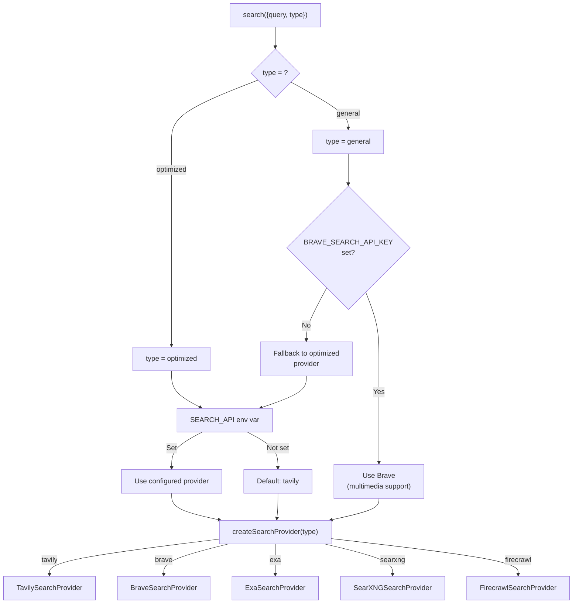

# Search Providers

Vana uses a factory pattern to support multiple search backends. Providers are interchangeable and selected via the `SEARCH_API` environment variable, with Tavily as the default.

## Table of Contents

- [Provider Comparison](#provider-comparison)
- [Provider Selection Logic](#provider-selection-logic)
- [Configuring Providers](#configuring-providers)
  - [Tavily (Default)](#tavily-default)
  - [Brave](#brave)
  - [Exa](#exa)
  - [SearXNG](#searxng) (includes [Advanced Search Mode](#searxng-advanced-search-mode))
  - [Firecrawl](#firecrawl)
- [Search in Quick vs Adaptive Modes](#search-in-quick-vs-adaptive-modes)
- [Search Tool Schema](#search-tool-schema)
- [Search Types: Optimized vs General](#search-types-optimized-vs-general)
- [Adding a New Provider](#adding-a-new-provider)

---

## Provider Comparison

| Provider      | Env Variable           | Content Snippets                        | Images                  | Videos                      | Search Depth                   | Domain Filtering     | Self-Hosted |
| ------------- | ---------------------- | --------------------------------------- | ----------------------- | --------------------------- | ------------------------------ | -------------------- | ----------- |
| **Tavily**    | `TAVILY_API_KEY`       | Yes (with answers)                      | Yes (with descriptions) | No                          | basic / advanced               | Include + Exclude    | No          |
| **Brave**     | `BRAVE_SEARCH_API_KEY` | Basic descriptions                      | Yes (thumbnails)        | Yes (thumbnails + duration) | No                             | No                   | No          |
| **Exa**       | `EXA_API_KEY`          | Yes (highlights)                        | No                      | No                          | Ignored                        | Include + Exclude    | No          |
| **SearXNG**   | `SEARXNG_API_URL`      | Yes                                     | Yes                     | No                          | basic / advanced               | Include only (site:) | Yes         |
| **Firecrawl** | `FIRECRAWL_API_KEY`    | Yes (markdown, truncated to 1000 chars) | Yes                     | No                          | basic (web) / advanced (+news) | No                   | No          |

**Recommended setup:** Tavily as the primary (optimized) provider with Brave as the secondary (general) provider for multimedia support.

---

## Provider Selection Logic

The search tool determines which provider to use based on the `type` parameter (optimized vs general) and available API keys.



In Quick Mode, the search type is always forced to `optimized` regardless of what the model requests. In Adaptive Mode, the model can freely choose between `optimized` and `general`.

---

## Configuring Providers

### Tavily (Default)

The primary AI-focused search provider. Returns rich content snippets, image descriptions, and optional answer summaries.

**Environment variables:**

```
TAVILY_API_KEY=tvly-...
SEARCH_API=tavily          # Optional, tavily is the default
```

**Features:**

- Minimum 5-character query enforced (padded if shorter)
- Minimum 5 results per request (even if fewer requested)
- `include_answers: true` returns an AI-generated answer alongside results
- `include_image_descriptions: true` returns descriptive text for each image
- Supports both `basic` and `advanced` search depth
- Full domain include/exclude filtering

**Source:** `lib/tools/search/providers/tavily.ts`

---

### Brave

The general-purpose search provider with multimedia support. Brave is the only provider that supports video and image content types as separate search endpoints.

**Environment variables:**

```
BRAVE_SEARCH_API_KEY=BSA...
```

**Features:**

- Parallel execution of web, video, and image searches when multiple content types requested
- Video results include thumbnails, duration, publisher, and date
- Image results include thumbnails with multiple fallback sources
- Automatically selected for `type="general"` searches when API key is present
- Does not support domain filtering or search depth

**Content types:**

| Content Type | Brave Endpoint          | Returned Data                         |
| ------------ | ----------------------- | ------------------------------------- |
| `web`        | `/res/v1/web/search`    | Title, description, URL               |
| `video`      | `/res/v1/videos/search` | Title, thumbnail, duration, publisher |
| `image`      | `/res/v1/images/search` | Title, thumbnail URL, dimensions      |

**Source:** `lib/tools/search/providers/brave.ts`

---

### Exa

An AI-native search engine that returns highlighted content snippets. Uses the official `exa-js` SDK.

**Environment variables:**

```
EXA_API_KEY=...
SEARCH_API=exa
```

**Features:**

- Uses `searchAndContents` with highlights enabled
- Returns highlighted content passages (joined with spaces)
- Supports domain include/exclude filtering
- Search depth parameter is accepted but ignored
- Does not return images

**Source:** `lib/tools/search/providers/exa.ts`

---

### SearXNG

A self-hosted, privacy-respecting metasearch engine. SearXNG aggregates results from multiple upstream engines (Google, Bing, DuckDuckGo, Wikipedia).

**Environment variables:**

```
SEARXNG_API_URL=http://localhost:8080     # Base URL of your SearXNG instance
SEARCH_API=searxng
SEARXNG_DEFAULT_DEPTH=basic               # Optional, set to 'advanced' for default advanced depth
```

**Features:**

- Self-hosted (no API key required, just a URL)
- Aggregates results across general and image categories
- Search depth changes engine selection and safety settings:
  - `basic`: Google + Bing, safesearch on, time range limited to past year
  - `advanced`: Google + Bing + DuckDuckGo + Wikipedia, safesearch off, no time range limit
- Domain include filtering via `site` parameter (exclude not supported)
- Supports advanced search via a dedicated `/api/advanced-search` route (SearXNG only)
- Image URLs are resolved relative to the SearXNG instance URL when needed

**Source:** `lib/tools/search/providers/searxng.ts`

#### SearXNG Advanced Search Mode

When `SEARXNG_DEFAULT_DEPTH=advanced` is set, searches are routed through a dedicated `/api/advanced-search` API route instead of querying SearXNG directly. This route performs deep content extraction with page crawling, relevance scoring, and Redis caching.

**Additional environment variables for advanced mode:**

```
SEARXNG_DEFAULT_DEPTH=advanced                          # Enables the advanced search route
SEARXNG_ENGINES=google,bing,duckduckgo,wikipedia        # Engines to query (default)
SEARXNG_TIME_RANGE=None                                 # Time filter (None = no filter)
SEARXNG_SAFESEARCH=0                                    # Safe search level (0 = off)
SEARXNG_MAX_RESULTS=50                                  # Max results cap (10-100, default 50)
SEARXNG_CRAWL_MULTIPLIER=4                              # Fetch N * multiplier pages, keep top N

# Redis for caching (pick one pair)
UPSTASH_REDIS_REST_URL=https://...                      # Upstash Redis
UPSTASH_REDIS_REST_TOKEN=AXxx...
# -- or --
LOCAL_REDIS_URL=redis://localhost:6379                   # Local Redis
```

**Advanced search flow:**

1. Check Redis cache for existing results (1-hour TTL)
2. Query SearXNG for `maxResults * SEARXNG_CRAWL_MULTIPLIER` results
3. Crawl each result page with JSDOM (20-second timeout per page)
4. Extract main content (prioritizes `<main>`, `<article>`, `.content`, `#content`)
5. Filter by content quality (50+ words, 3+ sentences, reasonable sentence length)
6. Score relevance: exact phrase match (+30), word frequency (+3 per occurrence), title matches (+10-20), recency bonus (+5 to +15), content length bonus (+5), highlight density (+2 per match)
7. Filter results below minimum relevance score of 10
8. Return top `maxResults` sorted by score, cache in Redis

**Source:** `app/api/advanced-search/route.ts`

---

### Firecrawl

A web scraping service that returns markdown-formatted content alongside search results.

**Environment variables:**

```
FIRECRAWL_API_KEY=fc-...
SEARCH_API=firecrawl
```

**Features:**

- Returns markdown content (truncated to 1000 characters per result)
- Advanced search depth adds news sources alongside web results
- Always includes image search results
- Domain filtering is not currently supported by the Firecrawl Search API
- Uses the `FirecrawlClient` wrapper from `lib/firecrawl`

**Source:** `lib/tools/search/providers/firecrawl.ts`

---

## Search in Quick vs Adaptive Modes

The researcher agent operates in two modes that affect how search works:

| Aspect          | Quick Mode                       | Adaptive Mode                                   |
| --------------- | -------------------------------- | ----------------------------------------------- |
| Max agent steps | 20                               | 50                                              |
| Search type     | Forced `optimized` (wrapped)     | Agent chooses `general` or `optimized`          |
| Available tools | `search`, `fetch`, display tools | `search`, `fetch`, `todoWrite`\*, display tools |
| Multimedia      | Not available (always optimized) | Available if Brave is configured                |

\* `todoWrite` is only available with the quality model type.

In **Quick Mode**, the search tool is wrapped by `wrapSearchToolForQuickMode` (in `lib/agents/researcher.ts`) to force `type: "optimized"` on every call, ensuring fast content-rich results regardless of what the agent requests.

In **Adaptive Mode**, the agent freely chooses between `type: "general"` and `type: "optimized"`, enabling multimedia search through Brave when configured.

---

## Search Tool Schema

The search tool exposes these parameters to the agent (defined in `lib/schema/search.tsx`):

| Parameter         | Type                                        | Default       | Description                        |
| ----------------- | ------------------------------------------- | ------------- | ---------------------------------- |
| `query`           | string                                      | (required)    | Search query text                  |
| `type`            | `"general"` \| `"optimized"`                | `"optimized"` | Provider routing hint              |
| `content_types`   | `("web" \| "video" \| "image" \| "news")[]` | `["web"]`     | Content types (Brave only)         |
| `max_results`     | number                                      | 20            | Max results (minimum enforced: 10) |
| `search_depth`    | `"basic"` \| `"advanced"`                   | `"basic"`     | Search depth level                 |
| `include_domains` | string[]                                    | `[]`          | Restrict to these domains          |
| `exclude_domains` | string[]                                    | `[]`          | Exclude these domains              |

A strict variant of the schema (all fields required, no defaults) is used for OpenAI reasoning models whose names start with `o` (e.g., `o1`, `o3`).

---

## Search Types: Optimized vs General

The search tool supports two types that map to different provider behaviors:

### Optimized (Default)

Used by the configured `SEARCH_API` provider (Tavily by default). Returns rich content snippets alongside results, reducing the need for follow-up fetch calls.

- Forced in Quick Mode (overridden by `wrapSearchToolForQuickMode`)
- Best for research queries where content extraction matters
- Providers: Tavily, Exa, SearXNG, Firecrawl

### General

Intended for time-sensitive queries and multimedia content. Routes to Brave when available, otherwise falls back to the optimized provider.

- Available in Adaptive Mode only (Quick Mode forces optimized)
- Supports `content_types` parameter for video/image filtering (Brave only)
- Results typically need a follow-up `fetch` call for detailed content
- Provider: Brave (when `BRAVE_SEARCH_API_KEY` is set)

The search config utility at `lib/utils/search-config.ts` dynamically adjusts the tool description and agent prompts based on which providers are available.

---

## Adding a New Provider

To add a new search provider:

### 1. Create the provider class

Create a new file at `lib/tools/search/providers/<name>.ts`:

```typescript
import { SearchResults } from '@/lib/types'
import { BaseSearchProvider } from './base'

export class MySearchProvider extends BaseSearchProvider {
  async search(
    query: string,
    maxResults: number,
    searchDepth: 'basic' | 'advanced',
    includeDomains: string[],
    excludeDomains: string[],
    options?: {
      type?: 'general' | 'optimized'
      content_types?: Array<'web' | 'video' | 'image' | 'news'>
    }
  ): Promise<SearchResults> {
    const apiKey = process.env.MY_PROVIDER_API_KEY
    this.validateApiKey(apiKey, 'MY_PROVIDER')

    // Implement search logic...

    return {
      results: [
        // { title, url, content }
      ],
      query,
      images: [],
      number_of_results: 0
    }
  }
}
```

The `BaseSearchProvider` class provides `validateApiKey()` and `validateApiUrl()` helper methods.

### 2. Register in the factory

Update `lib/tools/search/providers/index.ts`:

```typescript
// Add to the type union
export type SearchProviderType =
  | 'tavily'
  | 'exa'
  | 'searxng'
  | 'firecrawl'
  | 'brave'
  | 'my-provider'  // Add here

// Add to the switch in createSearchProvider()
case 'my-provider':
  return new MySearchProvider()
```

### 3. Add environment variables

Add the API key to your `.env.local`:

```
MY_PROVIDER_API_KEY=...
SEARCH_API=my-provider
```

Update `docs/ENVIRONMENT.md` under "Search provider options" and add a commented entry to `.env.local.example`.

### 4. Test with the agent

```bash
SEARCH_API=my-provider MY_PROVIDER_API_KEY=... bun dev
```

Verify that:

- The search tool returns valid results with `results`, `images`, `query`, and `number_of_results`
- Citation mapping works (applied automatically by `search.ts` after your provider returns)
- The agent can generate cited answers from the results
- Error cases (missing API key, network failures) throw descriptive errors

### 5. SearchResults interface

Your provider must return the `SearchResults` type defined in `lib/types`:

```typescript
interface SearchResults {
  results: SearchResultItem[] // { title, url, content?, description? }
  query: string
  images: (string | SearchResultImage)[]
  number_of_results: number
  videos?: SerperSearchResultItem[]
  citationMap?: Record<number, SearchResultItem>
  toolCallId?: string
}
```

The `citationMap` and `toolCallId` fields are added automatically by the search tool after your provider returns results.
